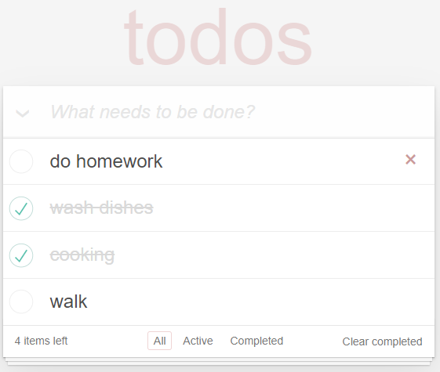

# React Simple Todo App
## Proje, patika.dev React modülündeki ödev için hazırlanmıştır.
- İlgili Ödev Linki [react todo-app odevi](https://app.patika.dev/moduller/react/odev2)
- Ödevin HTML-CSS Linki [todo-app only html-css](https://codepen.io/mehmetseven/pen/OJRzLjV)

#### `npm install` ile önce gerekli paketleri indirmelisiniz. Sonra `npm start` ile uygulamayı başlatabilisiniz. http://localhost:3000/ adresinde çalışacaktır.

## Uygulama Görünümü

- '*What needs to be done?*' yazan inputtan yeni yapılacak iş ekleyebilirsiniz.
- Inputun solundan tüm yapılacak işleri seçebilirsiniz.
- Inputun altında eklenen işleri görebilirsiniz.
- Fareyle listeden bir yapılacak işin üzerine geldiğimizde sağda çıkan çarpıdan o işi kaldırabiliriz.
- Bir işi 'tamamlandı' olarak işaretlemek için işin solundaki checkboxa tik atmamız yeterlidir.
- Dilersek tamamlanan işin tikine tıklayıp tekrardan 'tamamlanmadı' olarak işaretleyebiliriz.
- En altta listede bulunan tüm işlerin sayısını görebiliriz.
- '*All*' ile tüm işleri, '*Active*' ile tamamlanmayan ve '*Completed*' ile tamamlanan yapılacak işleri görüntüleyebiliriz.
- '*Clear Completed*' ile listede tamamlanmış tüm işleri kaldırabilirsiniz.
